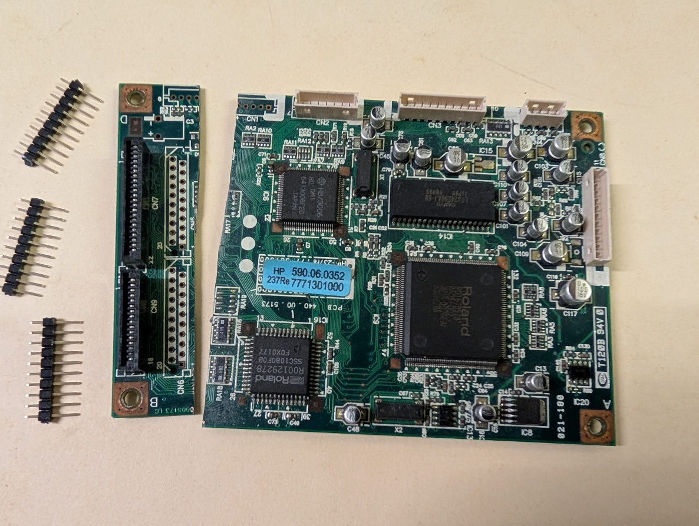
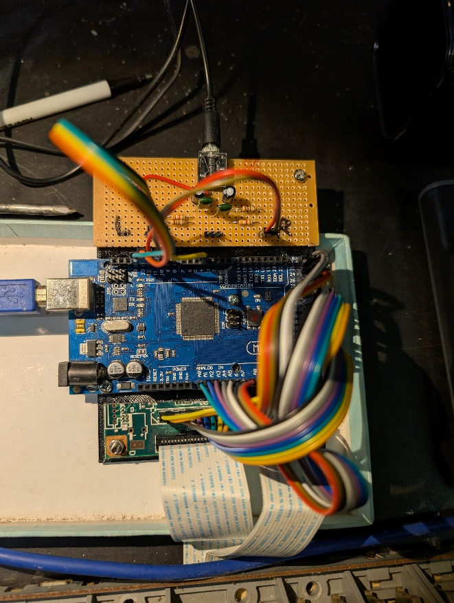
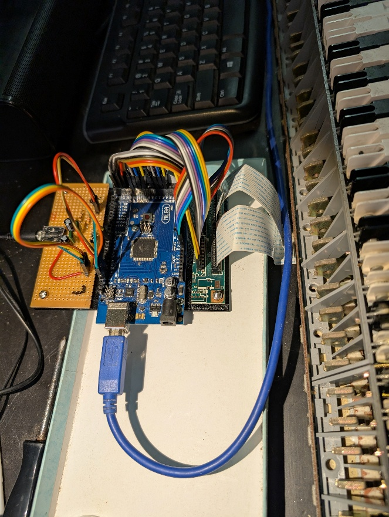

# Rolanduino – An Arduino piano/synthesizer

There are quite a few old Roland digital pianos lying around, but parts are impossible to obtain. I had an old HP-237Re whose mechanics were OK but the logic board had died. This project combines the scanning of the keyboard with a synthesizer based on a fork of [Arduino-midi-sound-module](https://github.com/DLehenbauer/arduino-midi-sound-module). I wondered if a Mega2560 could both scan the keyboard and manage the sound production seamlessly…

## Scanning the keyboard

There are many models of these old keyboards but the scanning details are usually quite similar. The schematics of a similar (but not quite the same!) model of Roland are provided here.

The keyboard is wired in groups of 8 keys (11 groups = 88 keys in total) The 8 T-lines are normally high, but each is pulled low in turn to sense each of the 8 notes in each group. Each group has a half-press and full-press line, the timing between them is used to sense key velocity.

In the service manuals they are called SM and PM lines (I don't know what this stands for) but some older keyboards have break and make lines instead.

So there are 11 groups \* 2 bits = 22 bits = 3 bytes reported back from each scan, for a total of 24 bytes from 8 scans.

The PM/SM lines are wired as follows on the Mega to the ports on the heel of the board (the double row connector) while the T lines are connected to port F. There are a lot of wires!

```
  bit     7       6       5       4       3       2       1       0
        -----------------------------------------------------------------
  PORTL |  PM3  |  SM3  |  PM2  |  SM2  |  PM1  |  SM1  |  PM0  |  SM0  |
        -----------------------------------------------------------------
        -----------------------------------------------------------------
  PORTC |  PM7  |  SM7  |  PM6  |  SM6  |  PM5  |  SM5  |  PM4  |  SM4  |
        -----------------------------------------------------------------
        -----------------------------------------------------------------
  PORTA |       |       | PM10  | SM10  |  PM9  |  SM9  |  PM8  |  SM8  |
        -----------------------------------------------------------------
        -----------------------------------------------------------------
  PORTF |  T7   |  T6   |  T5   |  T4   |  T3   |  T2   |  T1   |  T0   |
(output)-----------------------------------------------------------------
```

## Wiring it up

The old logic board is connected to the keyboard by a couple of flat flexible (FFC) cables. These are fragile and unobtainable, as are their sockets. Fortunately the logic board has holes for a couple of different types of keyboards which could be used for 0.1” pitch pins. I sawed the rest of the logic board off to retain the FFC sockets.



I 3D-printed a carrier to mount the Mega on the original standoffs inside the piano case. The audio output circuit is the same as the one described in Arduino-midi-sound-module, but split into two channels for stereo because the original piano had left and right speakers. Once wired up it looked like this. Did I say a lot of wires?



## The program

My [library fork](https://github.com/gilesp1729/midi-sound-library) is responsible for making waves via PWM. It relies heavily on Timers 0, 1 and 2. The scanning code simply reads ports and gets interrupted a lot, so it needs to be robust against missing key presses. Since there is no UI, instrument selection is via the keyboard by holding down the very bottom note. While holding, playing any other note will select an instrument from the synth's internal table. Not all of them produce unique or correct sounds and have been (or will be) skipped. The percussion have also been skipped for now.

The instruments are arranged as follows by octave:

```
            -------------------------------------------------------------------------------
 Midi note  | 24       | 36       | 48        | 60       | 72       | 84       | 96       |
 Octave     | C1       | C2       | C3        | C4       | C5       | C6       | C7       |
            | Organs   | Brass    | Woodwinds | Pianos   | Pianos   | Strings  | Effects  |
            -------------------------------------------------------------------------------
 Synth inst     16-23      56-67      68-77      0-15                  24-46       52-55
   (from instruments_generated.h)
```

When in selection mode, the note you hear will always be in the Middle C octave.

The examples directory also contains a simple test program (scandump) for scanning the keyboard using approximately the same scanning logic.

## To be continued

Deleting more duplicate and non-working instruments from the selection interface.

Wiring audio outputs to existing power amp (once I can find the inputs; the PCB is quite different from the one in the manual)

Organising a power supply for the Mega and tidying up piano case.

Connecting up, and writing code to handle, the three standard piano pedals (soft, sostenuto and sustain)
